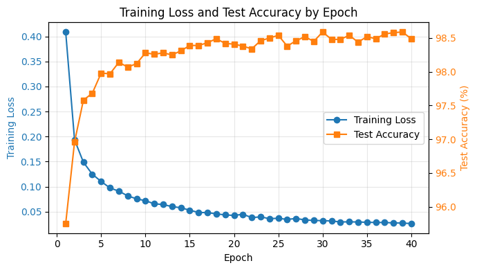

# MNIST 손글씨 인식 과제 보고서

## 0. 반·팀원

| 항목 | 내용 |
| --- | --- |
| **반** | SW-AI 301반 |
| **팀원** | 고민석, 나지운, 박건우, 박민석 |

---

## 1. 실험 목적

- PyTorch, TensorFlow 없이 **NumPy만으로 MNIST 손글씨 숫자 분류기 구현**
- Affine, ReLU, Softmax, Loss, Optimizer, BatchNorm, Dropout, 학습 루프 직접 구현
- 핵심 목표: 정확도뿐 아니라 `Forward -> Loss -> Backward -> Update` 흐름 이해

---

## 2. 모델 구조

| 구분 | 내용 |
| --- | --- |
| **입력** | 784차원 벡터 (28x28 픽셀 이미지를 flatten, 0~1 정규화) |
| **은닉층 1** | Affine(784 -> 512) -> BatchNorm -> ReLU -> Dropout |
| **은닉층 2** | Affine(512 -> 256) -> BatchNorm -> ReLU -> Dropout |
| **출력층** | Affine(256 -> 10) -> Softmax |

전체 구조는 다음과 같다.

```text
Input(784)
-> Affine(512)
-> BatchNorm
-> ReLU
-> Dropout
-> Affine(256)
-> BatchNorm
-> ReLU
-> Dropout
-> Affine(10)
-> Softmax
```

은닉층 활성화 함수로 ReLU를 사용했기 때문에 가중치는 He initialization으로 초기화했다.

---

## 3. 학습 설정

| 항목 | 값 |
| --- | --- |
| **Optimizer** | Adam |
| **Learning Rate** | 0.001 |
| **Epochs** | 20 |
| **Batch Size** | 128 |
| **Dropout 비율** | 0.5 |
| **BatchNorm Momentum** | 0.9 |
| **가중치 초기화** | He initialization |
| **손실 함수** | Cross Entropy Loss |

> Epoch는 전체 학습 데이터를 한 번 모두 보는 단위이다. 20 epoch는 전체 데이터를 20번 반복해 학습했다는 의미이다.

각 mini-batch마다 다음 순서로 학습을 수행했다.

```text
Forward -> Loss -> Backward -> Optimizer Update
```

- **Forward**: 입력 이미지로 예측값 계산
- **Loss**: 정답과 예측의 차이 계산
- **Backward**: 각 가중치를 어느 방향으로 고칠지 계산
- **Update**: Adam으로 가중치와 편향 수정

> 문제를 풀고, 채점하고, 틀린 이유를 되짚은 다음, 다음에는 더 잘 풀도록 파라미터를 고치는 과정이다.

---

## 4. 실험 환경

| 항목 | 내용 |
| --- | --- |
| **Python** | Python 3.11 |
| **주요 라이브러리** | NumPy, Matplotlib |
| **테스트 도구** | Pytest |
| **실행 환경** | CPU |
| **학습 소요 시간** | 약 4분 |


---

## 5. 결과

| 항목 | 값 |
| --- | --- |
| **테스트 정확도** | 98.54% |
| **총 파라미터 수** | 537,354 |


<details>
<summary>파라미터 수 계산</summary>

```text
W1: 784 x 512 = 401,408
b1: 512
W2: 512 x 256 = 131,072
b2: 256
W3: 256 x 10 = 2,560
b3: 10
BatchNorm gamma/beta: (512 + 512) + (256 + 256) = 1,536
Total = 537,354
```

</details>

### 정확도 향상을 위한 설정

단순히 층을 크게 만드는 것보다 **학습 안정성**에 초점을 두었다.

| 설정 | 목적 |
| --- | --- |
| **He initialization** | ReLU에 맞게 초기 가중치 크기 조절 |
| **BatchNorm** | 층을 지날 때 값의 분포 안정화 |
| **Dropout** | 특정 뉴런 조합에 의존하는 과적합 완화 |
| **Adam** | 파라미터별 업데이트 크기를 조절해 안정적인 학습 지원 |

정리하면 가중치 초기화, 학습 안정화, 과적합 방지, 업데이트 안정성을 함께 챙기고자 했다.

### 학습 곡선

- epoch를 40까지 늘려 Training Loss와 Test Accuracy 변화를 함께 확인했다.
- 파란색 Training Loss는 epoch가 증가할수록 계속 감소했다.
- 주황색 Test Accuracy는 초반에 빠르게 상승한 뒤 98%대 중반에서 거의 유지되었다.
- 중반 이후에는 training loss가 더 낮아져도 test accuracy 향상 폭은 작아졌다.
- 결론: 심한 과적합은 보이지 않았지만, 일정 epoch 이후에는 추가 학습 효과가 점차 작아졌다.



---

## 6. 회고

- NumPy 배열 연산만으로 신경망의 주요 구성 요소를 직접 구현했다.
- `forward`에서 저장한 값이 `backward`에서 gradient 계산에 다시 사용되는 흐름을 확인했다.
- 학습 모드와 추론 모드에서 BatchNorm, Dropout 동작이 달라야 함을 확인했다.
- Colab T4 GPU에서 약 4분 동안 20 epoch 학습 후 98.54% 정확도를 달성했다.
