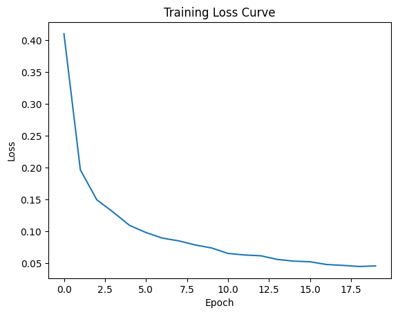

# MNIST 손글씨 인식 과제 보고서

## 0. 반·팀원

| 항목 | 내용 |
| --- | --- |
| **반** | SW-AI 301반 |
| **팀원** | 고민석, 나지운, 박건우, 박민석 |

---

## 1. 실험 목적

본 과제의 목적은 PyTorch, TensorFlow 같은 딥러닝 프레임워크 없이 NumPy만으로 MNIST 손글씨 숫자 분류기를 구현하는 것이다.

이를 위해 신경망의 핵심 구성 요소인 Affine 계층, ReLU, Softmax, Cross Entropy Loss, SGD, Adam, BatchNorm, Dropout, 학습 루프를 직접 구현했다. 단순히 정확도를 얻는 것뿐 아니라 `forward -> loss -> backward -> update` 흐름에서 각 계층이 어떤 값을 계산하고 저장하는지 이해하는 데 초점을 두었다.

---

## 2. 모델 구조

| 구분 | 내용 |
| --- | --- |
| **입력** | 784차원 벡터 (28x28 픽셀 이미지를 flatten, 0~1 정규화) |
| **은닉층 1** | Affine(784 -> 512) -> BatchNorm -> ReLU -> Dropout |
| **은닉층 2** | Affine(512 -> 256) -> BatchNorm -> ReLU -> Dropout |
| **출력층** | Affine(256 -> 10) -> Softmax |

전체 구조는 다음과 같다.

```text
Input(784)
-> Affine(512)
-> BatchNorm
-> ReLU
-> Dropout
-> Affine(256)
-> BatchNorm
-> ReLU
-> Dropout
-> Affine(10)
-> Softmax
```

은닉층 활성화 함수로 ReLU를 사용했기 때문에 가중치는 He initialization으로 초기화했다.

---

## 3. 학습 설정

| 항목 | 값 |
| --- | --- |
| **Optimizer** | Adam |
| **Learning Rate** | 0.001 |
| **Epochs** | 20 |
| **Batch Size** | 128 |
| **Dropout 비율** | 0.5 |
| **BatchNorm Momentum** | 0.9 |
| **가중치 초기화** | He initialization |
| **손실 함수** | Cross Entropy Loss |

### 정확도 향상을 위한 설정

정확도와 학습 안정성을 높이기 위해 ReLU에 적합한 He initialization을 사용했다. 초기 가중치가 너무 크거나 작으면 학습이 불안정해질 수 있기 때문에, 각 층의 입력 차원에 맞춰 가중치를 초기화했다.

또한 BatchNorm을 사용해 각 층의 입력 분포가 학습 중 크게 흔들리지 않도록 했고, Dropout을 적용해 특정 뉴런 조합에 과하게 의존하는 것을 줄였다. Optimizer는 SGD 대신 Adam을 사용해 파라미터별 이동평균을 기반으로 더 안정적으로 갱신되도록 했다.

각 mini-batch마다 다음 순서로 학습을 수행했다.

```text
Forward -> Loss -> Backward -> Optimizer Update
```

- **Forward**: 입력 이미지를 모델에 넣어 예측값을 계산한다.
- **Loss**: 예측값이 정답과 얼마나 다른지 Cross Entropy Loss로 계산한다.
- **Backward**: 손실을 바탕으로 각 가중치를 어느 방향으로 고쳐야 할지 gradient를 계산한다.
- **Update**: 계산된 gradient를 이용해 Adam optimizer가 가중치와 편향을 수정한다.

즉, 문제를 풀고, 채점하고, 틀린 이유를 되짚은 다음, 다음에는 더 잘 풀도록 파라미터를 고치는 과정이다.

---

## 4. 실험 환경

| 항목 | 내용 |
| --- | --- |
| **Python** | Python 3.11 |
| **주요 라이브러리** | NumPy, Matplotlib |
| **테스트 도구** | Pytest |
| **실행 환경** | Google Colab T4 GPU |
| **학습 소요 시간** | 약 4분 |
| **단위 테스트 실행 시간** | 3.45초 |


---

## 5. 결과

| 항목 | 값 |
| --- | --- |
| **테스트 정확도** | 98.54% |
| **총 파라미터 수** | 537,354 |


테스트 결과:

```text
21 passed in 3.45s
```

총 파라미터 수는 다음과 같이 계산된다.

```text
W1: 784 x 512 = 401,408
b1: 512
W2: 512 x 256 = 131,072
b2: 256
W3: 256 x 10 = 2,560
b3: 10
BatchNorm gamma/beta: (512 + 512) + (256 + 256) = 1,536
Total = 537,354
```

### 손실 커브

아래 학습 곡선에서 epoch가 진행될수록 loss가 감소하는 것을 확인했다.



---

## 6. 회고

이번 과제에서는 신경망의 주요 구성 요소를 NumPy 배열 연산만으로 직접 구현했다. `Affine.forward`에서는 `x @ W + b`로 선형 변환을 수행했고, `Affine.backward`에서는 `dW`, `db`, `dx`의 shape가 각각 원래 파라미터 및 입력과 일치하는지 확인했다.

ReLU는 forward에서 양수 위치를 mask로 저장하고, backward에서 해당 위치로만 gradient가 흐르게 했다. Softmax는 overflow 방지를 위해 row별 최댓값을 빼고 확률을 계산했다.

BatchNorm은 학습 모드와 추론 모드를 분리했다. 학습 모드에서는 batch mean/variance를 사용하고 running mean/variance를 갱신했으며, 추론 모드에서는 running 통계를 사용했다. Dropout은 학습 모드에서 random mask를 적용하고, 추론 모드에서는 평균 출력 크기에 맞춰 scale했다.

Google Colab T4 GPU 환경에서 약 4분 동안 20 epoch 학습을 완료했고, 98.54%의 테스트 정확도를 확인했다. 이를 통해 구현한 순전파, 역전파, Adam 업데이트, BatchNorm, Dropout이 전체 학습 과정에서 정상적으로 연결됨을 확인할 수 있었다.
